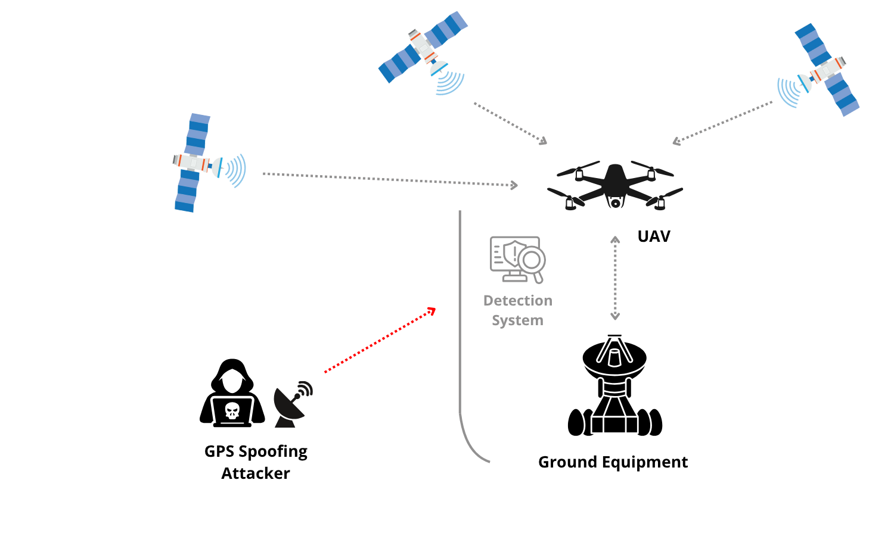

# ML program for detecting GPS spoofing attacks

## Project abstract

Unmanned Aerial Systems (UAS) have emerged as a key technology as a result of 
their various applications. These systems rely on the Global Positioning 
System (GPS), which remains  unencrypted for civilian use, making UAS 
vulnerable to GPS spoofing attacks. Therefore, this work proposes a case study 
to detect such attacks by employing machine learning classifiers, namely 
k-Nearest Neighbors (kNN), Nu-Support Vector Machine (NuSVM), Gaussian Naive 
Bayes (Gaussian NB), Bernoulli Naive Bayes (Bernoulli NB), and 
Artificial Neural Network (ANN).  Moreover, a comparative study of Spearman 
correlation, and L1 Regularization (Lasso) techniques for feature selection 
was carried out. Results showed that the ANN classifier outperformed all other 
classifiers using the Spearman selection feature, achieving an accuracy of 
91.12\%. Furthermore, using the Spearman and Lasso methods improved relatively 
the performance of Bernoulli and kNN classifiers.

  
   
  <em>Figure. Diagram of a GPS Spoofing attack on UAS.</em>

## How to use